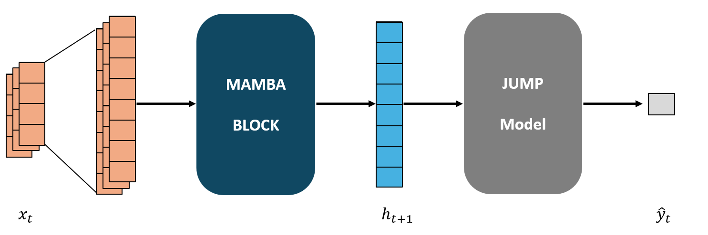

# Regime Mamba: Regime Switch Detection in Financial Time Series via Mamba-Jump Hybrid Deep Model

[](https://creativecommons.org/licenses/by-sa/4.0/)

## Overview

Regime Mamba is a novel hybrid deep learning architecture that combines the selective state space model (Mamba) with traditional Jump Models to identify financial market regimes. This is the first study to introduce modern deep learning methods to this domain, bridging the gap between neural architectures and economic regime theory.

### Key Features

- **Hybrid Architecture**: Combines Mamba's selective state space mechanism with traditional Jump Models
- **Superior Performance**: Achieves 5.5% annualized return with significantly lower volatility (11.6%) compared to buy-and-hold strategies (18.9% volatility)
- **Enhanced Risk Management**: Maximum drawdown of only -31.8% versus -65.2% for buy-and-hold strategies
- **Improved Sharpe Ratio**: 0.323, 10.2% higher than state-of-the-art models
- **Cross-market Generalizability**: Effective across both developed (S&P 500) and emerging markets (KOSPI)
- **Macro-factor Integration**: Incorporating the Dollar Index as a global macro indicator improves Sharpe ratios by 98.1% and reduces false signals by 6%

## Model Architecture



The Regime Mamba architecture consists of:

1. **Feature Extractor**: A Mamba-based deep learning model that processes time series data through selective state space layers
2. **Regime Predictor**: A Jump Model framework that identifies market regimes (Bull/Bear) based on extracted features
3. **Integrated Learning**: Combined training approach that leverages both representation learning and explicit regime identification

## Project Structure

```
regime_mamba/
├── __init__.py
├── config/               # Configuration modules
├── data/                 # Dataset handling
├── evaluate/             # Evaluation utilities
│   ├── clustering.py     # Regime identification
│   ├── strategy.py       # Trading strategy evaluation
│   ├── rolling_window.py # Rolling window backtesting
│   └── smoothing.py      # Signal smoothing techniques
├── models/               # Model implementations
│   ├── mamba_model.py    # Mamba architecture
│   ├── jump_model.py     # Jump Model implementation
│   └── lstm.py           # LSTM baseline
├── train/                # Training modules
└── utils/                # Utility functions
```

## License

This project is licensed under the Creative Commons Attribution-ShareAlike 4.0 International License.

## Acknowledgments
We acknowledge all data sources according to their respective licensing terms:

S&P 500 index, Treasury bills, Dollar Index, and individual stock data from Yahoo Finance
KOSPI and CD-91 data from the Bank of Korea's Economic Statistics System (ECOS) under the Korea Open Government License (KOGL Type 1)