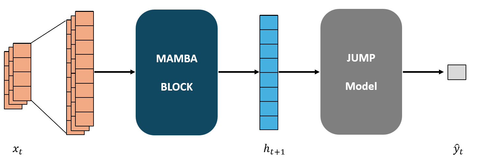

# Regime Mamba: Regime Switch Detection in Financial Time Series via Mamba-Jump Hybrid Deep Model

[](https://creativecommons.org/licenses/by-sa/4.0/)

## Overview

Regime Mamba is a novel hybrid deep learning architecture that combines the selective state space model (Mamba) with traditional Jump Models to identify financial market regimes. This is the first study to introduce modern deep learning methods to this domain, bridging the gap between neural architectures and economic regime theory.

### Key Features

- **Hybrid Architecture**: Combines Mamba's selective state space mechanism with traditional Jump Models
- **Superior Performance**: Achieves 5.5% annualized return with significantly lower volatility (11.6%) compared to buy-and-hold strategies (18.9% volatility)
- **Enhanced Risk Management**: Maximum drawdown of only -31.8% versus -65.2% for buy-and-hold strategies
- **Improved Sharpe Ratio**: 0.323, 10.2% higher than state-of-the-art models
- **Cross-market Generalizability**: Effective across both developed (S&P 500) and emerging markets (KOSPI)
- **Macro-factor Integration**: Incorporating the Dollar Index as a global macro indicator improves Sharpe ratios by 98.1% and reduces false signals by 6%

## Model Architecture



The Regime Mamba architecture consists of:

1. **Feature Extractor**: A Mamba-based deep learning model that processes time series data through selective state space layers
2. **Regime Predictor**: A Jump Model framework that identifies market regimes (Bull/Bear) based on extracted features
3. **Integrated Learning**: Combined training approach that leverages both representation learning and explicit regime identification

## Project Structure

```
regime_mamba/                  # Mamba-Jump hybrid (requires torch, mamba-ssm)
├── config/                    # Configuration classes (base, E2E, RL) and paper_config.yaml
├── data/                      # Dataset handling
├── evaluate/
│   ├── backtest_runner.py     # Generic rolling-window loop, result aggregation, 2-stage window flow
│   ├── schedule.py            # Rolling-window schedule
│   ├── smoothing.py           # Signal smoothing techniques
│   ├── smoothing_eval.py      # Per-window smoothing evaluation and comparison plots
│   ├── clustering.py          # Regime identification
│   ├── strategy.py            # Trading strategy evaluation
│   ├── rolling_window.py      # Rolling window backtesting (pretrained model)
│   └── rolling_window_w_train.py
├── models/                    # mamba_model, jump_model, lstm, e2e_regime_mamba, rl_regime_mamba
├── train/                     # train.py, e2e_train.py
└── utils/                     # set_seed, shared script I/O (logging, checkpoints, config dumps)

scripts/                       # Rolling-window backtest entry points
├── rolling_window_train_backtest.py        # 2-stage (Mamba + K-Means / Jump Model)
├── rolling_window_train_backtest_e2e.py    # 2-stage or End-to-End Regime Mamba (--e2e)
└── rolling_window_train_backtest_rl.py     # RL Regime Mamba (training loop not implemented yet)

regime_jm/                     # Statistical Jump Model regime pipeline (no torch needed)
run_pipeline.py                # Entry point of the regime_jm pipeline
tests/test_pipeline.py         # regime_jm tests (causality rules)
```

Mamba scripts are run from the repository root, e.g.
`python scripts/rolling_window_train_backtest.py --config regime_mamba/config/paper_config.yaml`.

## Installation (Regime Mamba)

The Mamba part (`regime_mamba/`, `scripts/`) depends on [`mamba-ssm`](https://github.com/state-spaces/mamba) and
[`causal-conv1d`](https://github.com/Dao-AILab/causal-conv1d), which ship custom CUDA kernels and officially
support **Linux + NVIDIA GPU** only. There is no CPU fallback for the Mamba layers.

### Linux

Requires an NVIDIA GPU, a CUDA toolkit (`nvcc`) matching your PyTorch build, and Python 3.10–3.12.

```bash
pip install torch==2.5.1 --index-url https://download.pytorch.org/whl/cu124
pip install packaging ninja wheel setuptools
pip install causal-conv1d==1.5.0.post8 --no-build-isolation
pip install mamba-ssm==2.2.4 --no-build-isolation
pip install -e .
# LaTeX is used by jumpmodels' matplotlib settings
sudo apt-get install -y texlive-latex-base texlive-latex-extra texlive-fonts-recommended dvipng cm-super
```

### Windows

`mamba-ssm` has no official Windows builds, but there are several ways to run this project on a Windows PC:

| Option | Difficulty | Notes |
|--------|-----------|-------|
| **WSL2 + Ubuntu** (recommended) | Easy | Uses the Linux steps above on your Windows NVIDIA GPU, no code changes |
| **Docker Desktop** (WSL2 backend) | Easy–medium | Reproducible container with `--gpus all` |
| **Native Windows build** | Hard | Needs MSVC, the CUDA toolkit and `triton-windows`, plus building `causal-conv1d`/`mamba-ssm` from source with a small patch |
| **Remote Linux / Colab** | Easy | For machines without an NVIDIA GPU |

See **[docs/WINDOWS_SETUP.md](./docs/WINDOWS_SETUP.md)** for step-by-step instructions, version pinning,
Windows-specific runtime notes (LaTeX, multiprocessing) and troubleshooting.

The Jump Model pipeline below (`regime_jm`, `run_pipeline.py`) needs neither torch nor `mamba-ssm`,
so it runs natively on Windows with `pip install -r requirements-jm.txt`.

## Jump Model 국면 파이프라인 (`regime_jm`)

입구는 `run_pipeline.py`의 `run_pipeline()`이고, `main()`이 CLI를 처리합니다.

```
입력 파일(날짜·종가·무위험금리)
  │  data_io.py          1) 로드·정제 → 초과수익률 (+ 벤치마크 차감 rel_ret)
  │  features.py         2) EWM downside deviation · Sortino (+ extra / 커스텀 변수)
  │  rolling.py          3) 1·7월 첫 영업일마다 재추정(최대 3000일, 최소 500일 학습창) + 사이 구간 온라인 추론
  │  backtest.py         4) 0/1 전략 백테스트 · 성과표 · 거래 지연 로버스트니스
  │  hmm_benchmark.py    5) HMM 벤치마크와 비교 (--hmm)
  │  weights.py          6) 변수 유형별 가중 비중 (sjm)
  │  regime_episodes.py     bear 에피소드 · 유사 국면 · 종료 시나리오
  ▼  plotting.py         7) csv 와 png 저장 (out/)
```

### 설치 · 실행

```bash
pip install -r requirements-jm.txt

python run_pipeline.py data.csv                                   # paper 피처, 연속형 JM(CJM)
python run_pipeline.py data.csv --model sjm --feature-set extra --pin-features sortino_20 --hmm
python run_pipeline.py sector.csv --relative-benchmark kospi.csv --backtest-ret relative
python run_pipeline.py data.csv --extra-features macro.csv:VIX:log macro.csv:USDKRW:logdiff 거래량:zscore_60
python run_pipeline.py data.csv --inference                       # 현재 반기 국면만 빠르게
python run_pipeline.py --help                                     # 전체 옵션
```

```python
from run_pipeline import run_pipeline
res = run_pipeline(input="data.csv", out_dir="out", model="sjm", feature_set="extra")
res["performance"], res["current_state"]
```

### 주요 옵션

| 단계 | 옵션 |
|---|---|
| 데이터 | `--date-col/--close-col/--rf-col` (기본 자동 인식), `--rf-unit` (기본 연율 %, `/100/252`), `--rf-const`, `--relative-benchmark PATH`, `--signal-ret {auto,absolute,relative}`, `--start/--end` |
| 피처 | `--feature-set {paper,example,extra,none}`, `--extra-features 파일:열:변환`, `--remove-series 계열`, `--warmup 252` |
| 모델 | `--model {jm,sjm}`, `--discrete` (기본은 연속형 cont=True), `--n-states`, `--jump-penalty 50`, `--max-feats`, `--pin-features` |
| 재추정 | `--train-window 3000`, `--min-train 500`, `--refit-months 1,7`, `--oos-start` |
| 백테스트 | `--delay 1`, `--delays 1,2,3,5,10`, `--min-cash/--max-cash`, `--cost-bps 10`, `--cost-buy-bps/--cost-sell-bps`, `--backtest-ret {absolute,relative}` |
| HMM | `--hmm`, `--hmm-refit 21`, `--hmm-median 5`, `--hmm-states 2` |

- 입력 파일: csv/tsv/xlsx. 인코딩은 utf-8 → cp949 → euc-kr 순으로 시도하고, `1,234.5`·`3.5%` 같은 표기도 숫자로 읽습니다.
- 피처 세트: `paper` = DD-log_10, sortino_20, sortino_60 (논문 Table 2) / `example` = ret·DD-log·sortino × 5·20·60 (9개) / `extra` = ret·sortino·DD·std·var·mad·rms·vol-log·vol-chg × 5·20·60 (27개).
- 사용자 변수 변환: `none, log, diff_n, pct_n, logdiff_n, zscore_w, ewm_hl, lag_n` (`+`로 연결, 예: `logdiff+ewm_20`). 변환은 원래 관측 주기에서 적용한 뒤 거래일로 forward-fill 합니다. 파일을 생략하면 입력 파일의 열을 씁니다.
- `--backtest-ret relative`: bull이면 자산, bear이면 벤치마크를 보유하고 벤치마크 대비 초과성과(IR)로 평가합니다.
- 상태 0 = bull, 마지막 상태 = bear (`sort_by="cumret"`). 0/1 전략은 bear 상태에서만 현금(또는 벤치마크)으로 이동합니다.

### 출력 (`out/`)

| 파일 | 내용 |
|---|---|
| `regimes.csv` | 날짜별 온라인 국면·상태 확률·재추정 시점 |
| `refit_params.csv` | 재추정 × 상태별 중심점, 연율 수익률·변동성, stay_prob |
| `strategy.csv`, `performance.csv`, `regime_summary.csv` | 0/1 전략 일별 내역과 성과 |
| `delay_robustness.csv` | 거래 지연별 성과 (논문 Table 5) |
| `feat_weights.csv`, `weight_groups.csv` | (sjm) 피처 가중치와 유형·계열·기간별 비중 |
| `regime_episodes.csv`, `similar_episodes.csv`, `episode_path_rmse.csv`, `length_scenarios.csv` | 에피소드 지표, 유사 국면, 경로 RMSE, 종료 시나리오 |
| `hmm_regimes.csv`, `model_comparison.csv` | (--hmm) HMM 국면과 공통 구간 성과 비교 |
| `current_state.json`, `run_config.json` | 현재 국면 요약, 실행 설정 |
| `*.png` | 국면·누적수익률, 재추정 파라미터, 비중, 피처 가중, 에피소드 길이, 유사 국면 경로, 지연 로버스트니스 |

`--inference`는 가장 최근 반기 시작점 직전 3000일로 한 번만 학습하고 현재 반기만 온라인 추론합니다 (`inference_*.csv`, `current_state.json`; 전략 성과는 계산하지 않음).

### 인과성 규칙 (`tests/test_pipeline.py`에서 검증)

- 클리핑(3σ)과 표준화는 학습창에만 fit 합니다.
- 추론은 온라인 방식이라 각 날짜에 그날까지의 데이터만 씁니다 (재추정 구간 중간 이후 데이터를 바꿔도 이전 국면은 그대로).
- 거래는 신호보다 `delay`일 늦게 체결됩니다.

```bash
pip install pytest && python -m pytest tests/
```

## License

This project is licensed under the Creative Commons Attribution-ShareAlike 4.0 International License.

## Acknowledgments
We acknowledge all data sources according to their respective licensing terms:

S&P 500 index, Treasury bills, Dollar Index, and individual stock data from Yahoo Finance
KOSPI and CD-91 data from the Bank of Korea's Economic Statistics System (ECOS) under the Korea Open Government License (KOGL Type 1)